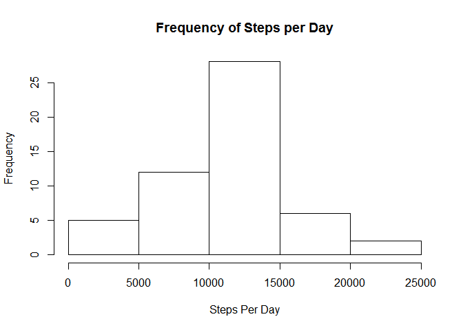
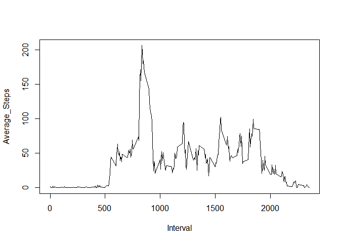
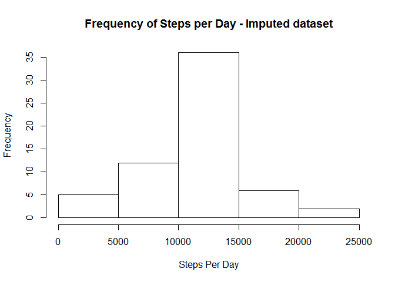
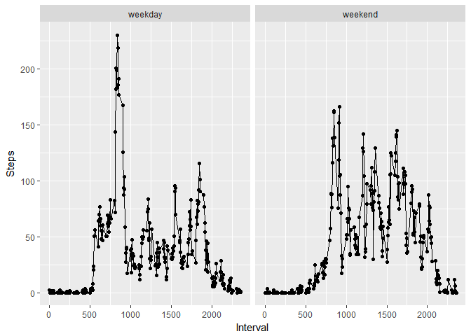

R Markdown file for Course Reproducible Research Week2 Project
==============================================================

\[A\] Loading and Preprocessing the data
========================================

    rm(list=ls())
    library(dplyr)

    ## 
    ## Attaching package: 'dplyr'

    ## The following objects are masked from 'package:stats':
    ## 
    ##     filter, lag

    ## The following objects are masked from 'package:base':
    ## 
    ##     intersect, setdiff, setequal, union

    library(ggplot2)
    activityData<-read.csv("activity.csv")

    ###Rename the variable names on the data frame to something more meaningful
    activityData<-setNames(activityData,c("Steps","MeasureDate","Interval"))
    ###Ignore the record with "NA" for Steps
    subActivityData<-subset(activityData,complete.cases(activityData))

\[B\] What is the mean total number of steps taken per day?
===========================================================

    ###Group the data by date for each day in the dataset
    grpd<-group_by(subActivityData,MeasureDate)

    ##B1. Calculate total number of steps taken each day
    stepsPerDay<-data.frame(tapply(grpd$Steps,grpd$MeasureDate,sum,na.rm=TRUE))
    stepsPerDay<-setNames(stepsPerDay,"Steps")

B2.Histogram of total number of steps taken each day

    hist(stepsPerDay$Steps,xlab="Steps Per Day",main="Frequency of Steps per Day")

    ##B3.1 Calculate and report the mean number of steps take each day
    meanStepsPerDay<-mean(stepsPerDay$Steps,na.rm = TRUE)

    ##B3.2 Calculate and report the median number of steps take each day
    medianStepsPerDay<-median(stepsPerDay$Steps,na.rm = TRUE)

Steps per day:

B3.1 Mean of all the Steps per Day is: 1.076618910^{4}

B3.2 Median of all the Steps per Day is: 10765

\[C\]What is the average daily pattern?
=======================================

    ##Covert the data type of the date variable from "Factor" to "Date"
    subActivityData$MeasureDate<-as.Date(subActivityData$MeasureDate,"%Y-%m-%d")

    ##Calculate the average number of steps per interval across all the days
    stepsPerInterval<-with(subActivityData,tapply(Steps,Interval,mean,na.rm=TRUE))
    stepsPerInterval<-data.frame(unique(subActivityData$Interval),stepsPerInterval)
    stepsPerInterval<-setNames(stepsPerInterval,c("Interval","Average_Steps"))

C1. Plot of 5-min intervals and average number of steps taken across all
days

    with(stepsPerInterval,plot(Interval,Average_Steps,type="l"))

    ##2 Calculate and report the Interval with max avg steps
    maxstepInterval<-stepsPerInterval[which.max(stepsPerInterval$Average_Steps),1]

C2. The interval with the maximum number of steps is 835

\[D\] Imputing missing values
=============================

    ##1.Calculate the number of record where no data is available for Steps 
    numOfNArecords<-sum(is.na(activityData$Steps))

D1. 2304 records don't have data associated with it (Steps=NA)

D2. We will fill the NA values in the dataset with the mean number of
steps corresponding to that interval.

    ##D3.Create a duplicate of the activiy data and then replace the NA value in Steps
    ##with the average number of steps for the corresponding interval

    newActivityData<-activityData

    for (i in seq_along(newActivityData$Steps)){
            
            if (is.na(newActivityData$Steps[i])){
                    interval<-newActivityData$Interval[i]
                    newActivityData$Steps[i]<-stepsPerInterval[stepsPerInterval$Interval==interval,2]
            }
    }

    ## Calculate the total steps take each day with the newActivityData
    newStepsPerDay<-tapply(newActivityData$Steps,newActivityData$MeasureDate,sum)
    newStepsPerDay<-data.frame(unique(newActivityData$MeasureDate),newStepsPerDay)
    newStepsPerDay<-setNames(newStepsPerDay,c("MeasureDate","Steps"))

D4.1 Histogram of total steps taken each day with imputed dataset

    hist(newStepsPerDay$Steps,xlab="Steps Per Day",main="Frequency of Steps per Day - Imputed dataset")

    ##4.3 Calculate and report the mean number of steps take each day with new dataset
    newMeanStepsPerDay<-mean(newStepsPerDay$Steps,na.rm = TRUE)

    ##4.4 Calculate and report the median number of steps take each day with new dataset
    newMedianStepsPerDay<-median(newStepsPerDay$Steps,na.rm = TRUE)

    diffMean<-abs(newMeanStepsPerDay-meanStepsPerDay)
    diffMedian<-abs(newMedianStepsPerDay-medianStepsPerDay)

D4.2 Steps per Day:

-   Mean of all the Steps per Day with imputed dataset is:
    1.076618910^{4}
-   Median of all the Steps per Day with imputed dataset is: 10765

D4.3 Impact of imputing the missing data on the estimates of steps per
day is as follows:

-   Impact on Mean: 0
-   Impact on Median: 1.1886792

<!-- -->

    ##Add a new variable to the newActivityData which shows day of the week for the date
    newActivityData<-newActivityData%>%
                            mutate(Weekday=weekdays(as.Date(MeasureDate)))
                            
    ##Add a new variable that show wether a day is a "weekday" or a "weekend"
    newActivityData<-newActivityData%>%
            mutate(Wkday=ifelse(Weekday%in%c("Saturday","Sunday"),"weekend","weekday"))

    ##Calculate average number of Steps for each of the intervals over "weekday" and "weekend"
    avgStepsWeekDayorEnd<-aggregate(Steps~Wkday+Interval,data=newActivityData,mean)

D4.4 Plot of average number of steps per interval - segregated by
weedays/weekends

    ##Plot Steps for intervals for weekday and weekend
    qplot(x=Interval,y=Steps,data=avgStepsWeekDayorEnd,facets=.~Wkday)+geom_line()

